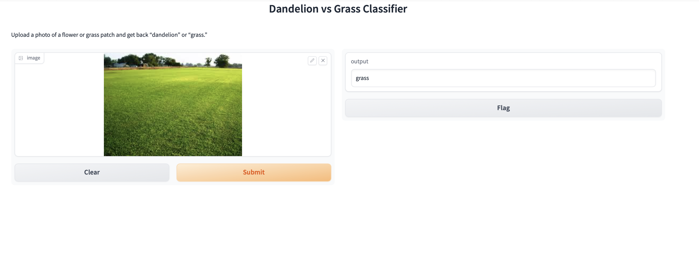
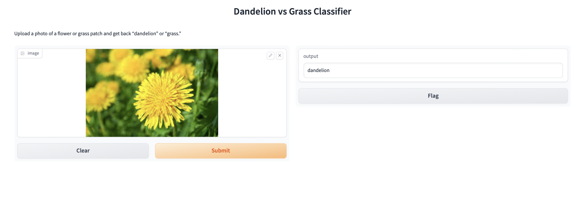
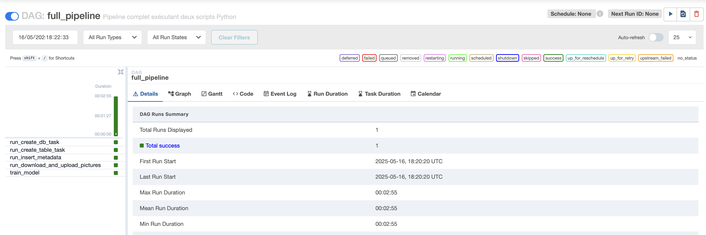
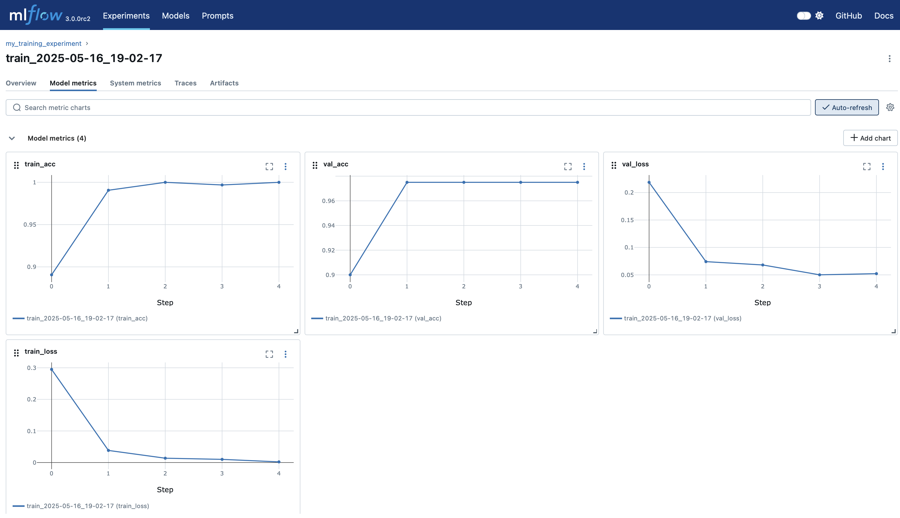
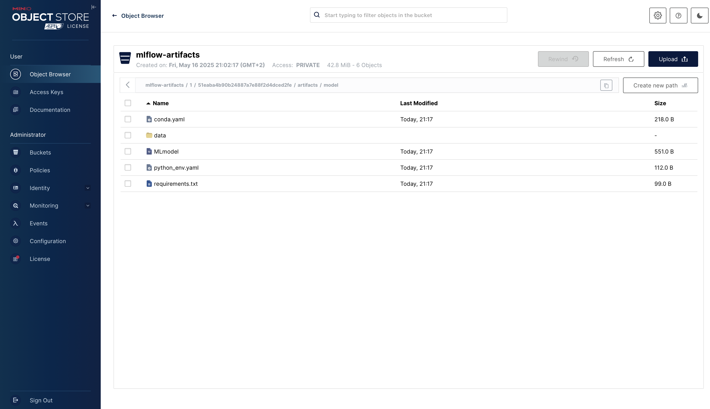

# Projet MLOps Classification

Ce dépôt contient un projet de classification d’images permettant de distinguer entre **dandelion** (pissenlit) et **grass** (herbe).

## Prérequis

- Docker et Docker Compose installés sur votre machine.

## Démarrage de l’infrastructure

1. Ouvrez un terminal et placez-vous dans le dossier du projet :

   ```bash
   cd infra/dev

2. Lancez l’infrastructure avec Docker Compose :

    ```bash
    docker-compose up -d --build

3. Démarrez le DAG "full_pipeline" dans Airflow

    Accédez aux différentes interfaces :
    - Interface Airflow : [http://localhost:8080](http://localhost:8080)
    - Web app de classification (Gradio) : [http://localhost:7860](http://localhost:7860)

4. Lancez Docker Compose avec:

    ```bash
    docker-compose up -d --build

### Aperçu de la webapp


### Aperçu de Airflow

### Aperçu de Mlflow

### Aperçu de Minio



5. Environnements : développement / production

Nous avons séparé deux environnements :

Développement : déploiement local à l’aide de Docker Compose.
Production : déploiement sur Kubernetes via un Helm chart.

Plusieurs micro-services s’exécutent déjà correctement dans le cluster ; Tous les micro-services ont été migrés vers le cluster, mais certains ne sont pas encore opérationnels.

6. Organisation de Git : 

- .env à la racine : Toutes les variables d’environnement (MLflow).
- infra/ : définitions d’infrastructure
- infra/dev/ : Docker Compose et scripts d’initialisation (BDD, index, etc.) pour le développement local
- infra/prod/helm/ : Helm charts et manifests Kubernetes pour la production
- src/ : code applicatif
- src/api/ : service FastAPI
- src/webapp/ : interface utilisateur (Gradio)
- logs/ : fichiers de logs générés localement (à ajouter dans .gitignore)
- .github/workflows/ : pipelines CI/CD GitHub Actions pour la construction, les tests et le déploiement des services.